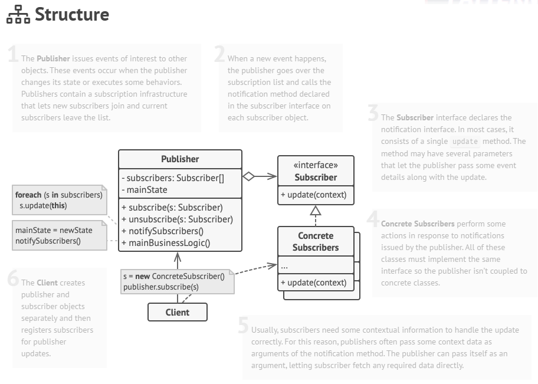
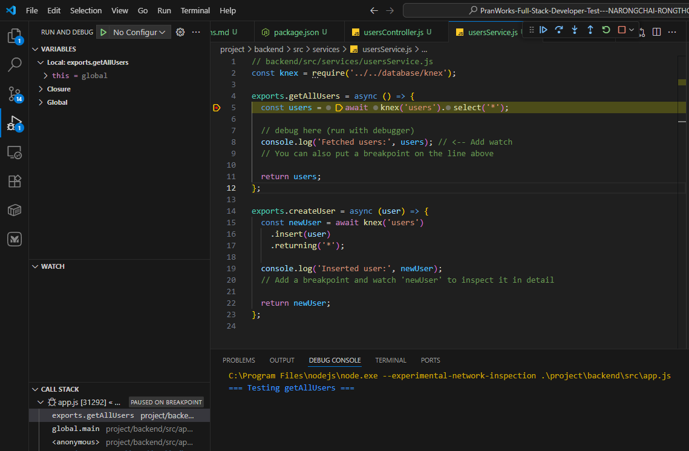

# PranWorks-Full-Stack-Developer-Test---NARONGCHAI-RONGTHONG

# แบบทดสอบวัดความรู้ตำแหน่ง Full Stack Developer

## 1. แบบวัดความรู้พื้นฐานวิศวกรรมซอฟต์แวร์

### 1.1 จงอธิบายเกี่ยวกับการออกแบบระบบด้วย Design Pattern ใดก็ได้ พร้อมยกตัวอย่างทั้งข้อดี และข้อเสีย
```
> Design pattern | Observer

ส่วนตัวผมชอบ pattern นี้มากๆและคิดว่าควรจะอยู่ในคาบเรียน OOP
Observer เป็น Design Pattern ที่จะให้มี object 2 ประเภทนั้นคือ Subscriber และ Publisher โดย subscriber จะคอยรอรับแจ้งเตือนจาก publisher

ยกตัวอย่างเช่นเรามี trafficLight as publisher, car as subscriber
เริ่มแรกพอ car เข้ามาใกล้ trafficLight เราก็ทำการเพิ่มไปใน subscriber[] ของ trafficLight 
ไฟแดงเราก็แจ้งไปให้ car ทุก instances ที่อยู่ใน subscriber[] โดยการทำงานส่วนใหญ่จะเป็นการ loop subscriber[] ไปรัน method ที่มีชื่อเดียวกันไว้
    
และที่เป็นข้อดีสุดๆคือหากเรามีหลาย Objects ที่จะได้รับระบบแบบนี้เช่นเรามี publisher อีกอันเป็น securityGuard และ subscriber อีกอันเป็น motorcycle
เราก็เติมไปด้วย inheritance และก็ทำแบบเดิมได้เลย

ส่วนข้อเสียคือ Memory leaks จากการที่เราจัด subscriber ไว้แล้วเราไม่ cleanup ให้หมดตอนเราไม่ใช้แล้ว ภาษาที่ไม่ได้รองรับการจัดการ memory ให้เราแบบนี้เช่น C หรือ C++ ก็จะเกิดเหตุการณ์แบบนี้ขึ้นได้
และถ้าเราจัดระบบนี้ไม่ดีระบบอาจจะซับซ้อนจนอ่านยากหรือ debug ได้ยากมากๆ ซึ่งที่ควรทำคืออย่าจัดรวมระบบนี้ไว้ในกับระบบการทำงานอื่นๆเช่น service หรือ controller
```


*ภาพประกอบ*

### 1.2 จงอธิบายหลักการของการออกแบบซอฟต์แวร์ที่ดีและมีคุณภาพมา 3 ข้อ

```
1. ความเรียบง่าย (Simplicity / KISS – Keep It Simple, Stupid)
  - ออกแบบโค้ดและระบบให้ง่ายต่อความเข้าใจและการบำรุงรักษา
  - ลดความซับซ้อนที่ไม่จำเป็น เพราะโค้ดที่ซับซ้อนมักเกิดบั๊กง่ายและแก้ไขยาก
  - ใช้กฎการตั้งชื่อตัวแปรและฟังก์ชันให้สอดคล้องกัน (Consistent Naming Convention)

2. การแยกหน้าที่อย่างชัดเจน (Separation of Concerns / SoC)
  - แต่ละโมดูลหรือคลาสควรมีหน้าที่เฉพาะตัว ไม่ทำหลายอย่างรวมกัน
  - ช่วยให้การทดสอบ การแก้ไข และการนำกลับมาใช้ซ้ำ (reusability) ง่ายขึ้น

3. ความสามารถในการปรับขยายและเปลี่ยนแปลง (Extensibility / Open-Closed Principle)
  - ระบบควรสามารถเพิ่มฟีเจอร์หรือปรับเปลี่ยนพฤติกรรมโดยไม่กระทบโค้ดเดิมมาก โดยพื้นฐานที่สุดคือหลีกเลี่ยงการใช้ Magic Number
  - ใช้ design pattern หรือ interface เพื่อรองรับการขยายระบบในอนาคต
```
### 1.3 จงอธิบายภาพตามความเข้าใจ และสรุปให้กระชับ พร้อมทั้งเสนอความคิดถ้าต้องพัฒนาโครงการใหม่ที่จะเกิดขึ้นในอีก 3 เดือนข้างหน้า จะมีข้อแนะนำอย่างไร?


```
อธิบาย:
- ภาพแสดง ตารางการสนับสนุน (Support Lifecycle) ของ .NET ตั้งแต่เวอร์ชัน 5 ถึง 9
- สี ม่วงเข้ม แสดงระยะ Standard Term Support (STS) ส่วนสี เทา แสดง Long Term Support (LTS)
- เวอร์ชันล่าสุดคือ .NET 7 (Nov 2022) โดยมี STS และ LTS ระบุระยะเวลาที่รับแพตช์

ข้อคิดสำหรับการพัฒนาโครงการใน 3 เดือนข้างหน้า:
- ควรเลือกเวอร์ชัน .NET ที่อยู่ใน LTS เช่น .NET 6 หรือ .NET 8 (เมื่อพร้อม) เพื่อความเสถียรและการสนับสนุนระยะยาว
- วางแผน การอัปเกรดเวอร์ชันล่วงหน้า หากโครงการจะยาวเกิน STS ของเวอร์ชันปัจจุบัน
- ใช้ library แบบ low coupling โดยรวมการเชื่อมต่อทั้งหมดผ่าน Adapter หรือ wrapper เพื่อตัด dependency ตรงกับระบบหลัก library ได้ง่ายโดยไม่กระทบส่วนอื่นของโปรเจกต์
```

## 2. แบบวัดความรู้ส่วนงาน (Frontend)

### 2.1 จงค้นหา HTML Template ที่เป็นเทรนด์ปัจจุบัน
- พร้อม source code
- ที่มาของ source code
- ระบุเหตุผลที่เลือก
- อธิบายโครงสร้างของ HTML Template
```
- Source code: https://github.com/BlackrockDigital/startbootstrap-agency
- Source: StartBootstrap – Free Bootstrap Templates
- เหตุผลที่เลือก: เป็น Landing Page ที่ทันสมัย มี responsive design และมี JavaScript ในการสร้าง interactive elements เช่น smooth scroll, responsive navbar, และ modal
- โครงสร้างของ HTML Template:
    - index.html – หน้าเว็บหลัก  
        - Header: เมนูนำทางด้านบน พร้อมโลโก้และลิงก์ไปยัง section ต่าง ๆ, navbar มี responsive behavior (collapse/expand)
        - Hero Section: พื้นที่แรกที่ผู้ใช้เห็น พร้อมปุ่ม Call-to-Action
        - Services Section: แสดงบริการ/ฟีเจอร์ พร้อม icon และ animation
        - Portfolio Section: แสดงตัวอย่างงาน มี modal popup
        - About Section: ข้อมูลเกี่ยวกับบริษัท
        - Team Section: ข้อมูลทีมงาน พร้อมรูปและ animation
        - Contact Section: ฟอร์มติดต่อ
        - Footer: ข้อมูลลิขสิทธิ์และลิงก์เสริม
```

### 2.2 จากข้อ 2.1 ตัว HTML Template มี function หรือใช้ JavaScript เกี่ยวกับด้านใดบ้าง
- แสดงตัวอย่าง source code
- อธิบายการทำงาน

```
- ตัว HTML Template มี function หรือใช้ JavaScript เกี่ยวกับด้านใดบ้าง
    - Responsive navbar toggle:
      เมื่อหน้าจอมีขนาดเล็ก (mobile/tablet) เมนูนำทางจะย่อเป็น hamburger menu การคลิก hamburger icon จะเปิดหรือปิดเมนู ทำให้ navbar ใช้งานได้ดีบนทุกอุปกรณ์

    - Smooth scrolling to sections: 
      เมื่อคลิกลิงก์ในเมนูที่ชี้ไปยัง section ภายในหน้าเว็บ หน้าจะเลื่อนอย่างนุ่มนวลไปยังตำแหน่งของ section แทนการกระโดดทันที ทำให้ UX ดูเป็นธรรมชาติ

    - Modal popup for portfolio items:
      ในส่วน Portfolio การคลิกที่รูปงานจะแสดง modal popup แสดงรายละเอียดหรือรูปภาพเพิ่มเติม โดยไม่ต้องโหลดหน้าใหม่ ช่วยให้ผู้ใช้เข้าถึงข้อมูลได้ทันที

    - Scroll-triggered animations (fade-in, slide-in):
      เมื่อผู้ใช้เลื่อนหน้าเว็บไปถึง section ต่าง ๆ ส่วนของเนื้อหาจะค่อย ๆ ปรากฏด้วย animation เช่น fade-in หรือ slide-in ทำให้หน้าเว็บมีความน่าสนใจและ dynamic
```
ตัวอย่าง source code:
```html
<!-- Smooth scrolling example -->
<script>
  $('a.js-scroll-trigger[href*="#"]:not([href="#"])').click(function() {
      if (location.pathname.replace(/^\//, '') == this.pathname.replace(/^\//, '') 
          && location.hostname == this.hostname) {
          var target = $(this.hash);
          target = target.length ? target : $('[name=' + this.hash.slice(1) + ']');
          if (target.length) {
              $('html, body').animate({
                  scrollTop: (target.offset().top - 72)
              }, 1000, "easeInOutExpo");
              return false;
          }
      }
  });
</script>
````

* การทำงาน: เมื่อคลิกลิงก์เมนูที่ชี้ไปยัง section ต่าง ๆ หน้าเว็บจะเลื่อนอย่างนุ่มนวลไปยังตำแหน่งของ section นั้น แทนการกระโดดทันที

### 2.3 แสดงตำแหน่งสถานที่ตั้งของนักศึกษา
- อธิบายเทคโนโลยีที่ควรใช้
- แสดงตัวอย่าง พร้อม source code

> ans: เทคโนโลยีที่ควรใช้: Google Maps JavaScript API หรือ Leaflet.js สำหรับการฝังแผนที่แบบ interactive  

**ตัวอย่าง source code (Google Maps API):**

```html
<div id="map" style="height:400px;"></div>
<script>
  function initMap() {
    const studentLocation = { lat: 13.7563, lng: 100.5018 }; // ตัวอย่างพิกัด
    const map = new google.maps.Map(document.getElementById("map"), {
      zoom: 15,
      center: studentLocation,
    });
    const marker = new google.maps.Marker({
      position: studentLocation,
      map: map,
      title: "ตำแหน่งนักศึกษา",
    });
  }
</script>
<script src="https://maps.googleapis.com/maps/api/js?key=YOUR_API_KEY&callback=initMap" async defer></script>
````

### 2.4 การแสดงรูปภาพจำนวน 11 รูปบนเว็บไซต์
- อธิบายวิธีการนำเสนอ
- แสดงตัวอย่าง พร้อม source code

> ans: วิธีการนำเสนอ - ใช้ **carousel** ที่สร้างด้วย **flexbox** เพื่อจัดรูปภาพให้เลื่อนซ้าย-ขวาอย่างสวยงาม และทำ responsive สำหรับทุกขนาดหน้าจอ

**ตัวอย่าง source code:**

```html
<script>
  // Data layer: array of image objects
  const imageData = [
    { src: 'img1.jpg', alt: 'รูปที่ 1' },
    { src: 'img2.jpg', alt: 'รูปที่ 2' },
    { src: 'img3.jpg', alt: 'รูปที่ 3' },
    { src: 'img4.jpg', alt: 'รูปที่ 4' },
    { src: 'img5.jpg', alt: 'รูปที่ 5' },
    { src: 'img6.jpg', alt: 'รูปที่ 6' },
    { src: 'img7.jpg', alt: 'รูปที่ 7' },
    { src: 'img8.jpg', alt: 'รูปที่ 8' },
    { src: 'img9.jpg', alt: 'รูปที่ 9' },
    { src: 'img10.jpg', alt: 'รูปที่ 10' },
    { src: 'img11.jpg', alt: 'รูปที่ 11' }
  ];

  const carousel = document.getElementById('carousel');

  // Dynamically create  elements from data layer
  imageData.forEach(image => {
    const img = document.createElement('img');
    img.src = image.src;
    img.alt = image.alt;
    carousel.appendChild(img);
  });
</script>

<div class="carousel" id="carousel"></div>

<style>
  .carousel {
    display: flex;
    overflow-x: auto;
    scroll-snap-type: x mandatory;
    gap: 10px;
    padding: 10px;
  }
  .carousel img {
    width: 300px;
    height: auto;
    border-radius: 5px;
    scroll-snap-align: start;
    flex-shrink: 0;
  }
</style>
```

### 2.5 การดูแลและตรวจสอบคุณภาพโค้ดของ HTML/CSS/JavaScript
- ระบุเทคโนโลยีหรือเครื่องมือที่สามารถใช้ได้
- ยกตัวอย่าง พร้อมเหตุผลในการเลือกใช้

```
เทคโนโลยีหรือเครื่องมือที่สามารถใช้ได้:
  - Linters: ESLint (JS), stylelint (CSS), HTMLHint (HTML)
  - Formatter: Prettier
  - Version Control: Git/GitHub สำหรับตรวจสอบ history และ pull request

ตัวอย่างและเหตุผล:
  - ใช้ ESLint เพื่อจับ error หรือ coding standard ของ JavaScript ทำให้โค้ดมีคุณภาพและลด bug
  - ใช้ stylelint ตรวจสอบ CSS เช่น property syntax, naming convention
  - ใช้ Prettier จัดรูปแบบโค้ดให้ consistent ทั้งโปรเจกต์ ลดความสับสนเวลาแก้โค้ดร่วมกัน
```

---

## 3. แบบวัดความรู้ส่วนงาน (Backend)

### 3.1 สร้างโปรเจคจาก .NET Core เวอร์ชัน 6 ขึ้นไป
- เลือกโปรเจคให้สนับสนุนการพัฒนา API

### 3.2 การเชื่อมต่อ Database
- ใช้ฐานข้อมูลจากข้อ 4
- นำมาใช้ในการพัฒนาข้อถัดไป

### 3.3 สร้าง API GET/POST จาก .NET Core
- ส่ง Request ที่มี Parameter อย่างน้อย 3 ตัว
- Response อย่างน้อย 5 ตัว

### 3.4 การ debug code
- ยกตัวอย่างการ add watch จาก object
- แสดงผลลัพธ์จากการ debug และ add watch



## 4. แบบวัดความรู้ส่วนงานการบริหารจัดการข้อมูล (Data)

### 4.1 ออกแบบฐานข้อมูล
- มีตารางอย่างน้อย 3 ตารางขึ้นไป และมี PK แบบ running number
- ระบุ FK ให้มีการเชื่อมทั้ง 3 ตาราง
- ระบุ column ในตารางอย่างน้อย 5 columns ขึ้นไป
  - data type: int, nvarchar(กำหนดค่าได้), Boolean, datetime
  - ส่วนตัวอื่น ๆ ให้กำหนดเอง

### 4.2 เขียน db script
- การ mock data ในแต่ละตารางให้มีอย่างน้อย 50 records

# คำตอบข้อ 3, 4 อยู่ใน [📂folder project](project)

## 5. แบบวัดความรู้การใช้เครื่องมือในการดูแลรักษาโค้ด (Source Control)

### 5.1 นำ source code จากโจทย์ข้อ 2 และ 3 ขึ้น source control
- ส่ง repository URL (เปิดแบบ Public)
```
ข้อนี้ผมว่าแปลกดี ถ้าจะวัดว่าขึ้นเป็นมั้ยดู project อื่นใน github ก็ได้นะครับ
https://github.com/t1ww
```

### 5.2 ตรวจสอบ Git repository แบบ public
- วิธีการตรวจสอบ source code ที่น่าสนใจ
- วิธีดำเนินการนำมาใช้งานต่อ
```
search ได้ที่ด้านบนเลยครับในหัวข้อที่สนใจ
fork มาใช้ หรือเปิดอ่านโค้ดแล้ว copy ส่วนที่จะใช้มา
ควรให้ credit ด้วยอย่างน้อยใน comment
```
### 5.3 อธิบายคำสั่ง Git
- `git rebase` และ `git merge`
- ยกตัวอย่าง และวิธีที่ควรนำไปใช้
```
git rebase - รวม timeline ของ commit ทั้งหมดให้เป็นเส้นเดียวกัน อันนี้จะได้เห็น timeline ของการทำงานแบบง่าย
git merge - เซฟ timeline แยกกันของแต่ละ branch และแสดงจุดรวมไว้ให้ อันนี้จะได้เห็น timeline ของการทำงานจริงๆมากกว่า

สองอันนี้อยู่ที่ความชอบมากกว่าว่าอันไหนสวยกว่า
```

## 6. แบบวัดแนวทางและจริยธรรมการทำงาน

### 6.1 จัดการสถานการณ์ต่าง ๆ

#### 6.1.1 เมื่อลูกค้าแจ้งข้อผิดพลาดในระบบ
- ข้อผิดพลาดเป็นผลจากโปรแกรมของตนเอง
- เกิดขึ้นวันศุกร์ เวลา 17.00 น.
- จะดำเนินการอย่างไร
```
ในด้านนี้มันก็ความรับผิดชอบเรา แต่ก็อยู่ที่เวลาทำงานและความร้ายแรงด้วย ถ้าเป็นปัญหาเล็กแต่แก้ยากเช่น css bug
ที่ต้นทางจากไหนไม่รู้มาทับ css ของเรา มันก็ไม่เหมาะสมที่จะต้องมาให้แก้ให้ได้ทันทีเลยนอกเวลางาน แต่หากเป็นอะไรที่ทำง่ายๆนี่ผมคงทำส่งให้จากที่บ้าน
และถ้าเป็นปัญหาใหญ่มากๆระดับ production ล่มทั้งหมด อันนี้ก็ควรที่จะตรวจดูที่ระบบซึ่งผมคงจะช่วยดูว่าล่มได้ไง
เช่นผมทำ bug ส่ง request เยอะมากๆนี้ผมก็จะรีบแก้ แล้วก็จะคงเขียนรายงานด้วยว่าระบบมันค่อนข้างอ่อนแอที่ปล่อยให้โดน
request overload ได้ง่าย ๆ แบบไม่มีอะไรกันเลย ควรจะมี gateway มาช่วยกรองหรือกันไม่ให้ใช้งานเกินไป
```

#### 6.1.2 เมื่อหัวหน้างานไม่มอบหมายงาน
- หรืองานของตนเองเสร็จก่อนกำหนด
- วิธีช่วยให้บริษัทสร้างประสิทธิผลมากขึ้น
```
เริ่มแรกด้วยการทบทวนงานที่เสร็จแล้วเพื่อหาจุดปรับปรุง, ศึกษาเทคโนโลยีหรือเครื่องมือใหม่ๆ ที่เกี่ยวข้องกับงาน และเสนอตัวช่วยทีมงานคนอื่นที่ยังมีงานค้างอยู่
```

#### 6.1.3 เมื่อเพื่อนร่วมงานไม่ให้ความร่วมมือ
- ส่งผลกระทบกับงานของตนเอง
- จะดำเนินการอย่างไร
```
ส่วนใหญ่ไม่ได้กระทบกับงานโดยตรงมากนัก เพราะสามารถทำการ mock ข้อมูลที่ต้องใช้ในส่วนของตนเองได้
ทำให้สามารถพัฒนาต่อและทดสอบการทำงานได้โดยไม่ต้องรอ อีกทั้งยังสามารถใช้แนวคิด adapter pattern
เพื่อปรับข้อมูลให้เข้ากับระบบของเรา หากข้อมูลจริงที่ได้รับมามีความแตกต่าง เพื่อให้มั่นใจว่างานสามารถเชื่อมต่อและทำงานร่วมกันได้ตามต้องการ  

อย่างไรก็ตาม หากการไม่ให้ความร่วมมือส่งผลต่อภาพรวมของทีม ควรเริ่มจากการพูดคุยโดยตรงกับเพื่อนร่วมงานเพื่อหาสาเหตุและแนวทางแก้ไขร่วมกัน
และหากยังไม่ได้ผล อาจขอคำปรึกษาหรือรายงานต่อหัวหน้างาน เพื่อไม่ให้เป้าหมายของทีมได้รับผลกระทบ
```
